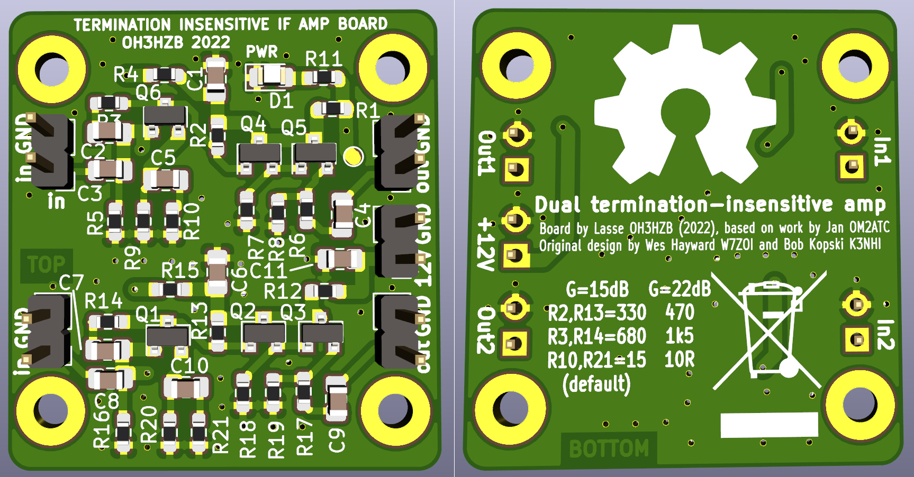

# if-amp-tia
Termination insensitive IF amplifier board (two independent UNIdirectional amplifiers on single board)
Powering: +12V regulated input.

PCB layout by Lasse OH3HZB (2022), based on work by Jan OM2ATC.
Original design by Wes Hayward W7ZOI and Bob Kopski K3NHI.

THE CONTENTS IN THIS REPOSITORY IS PROVIDED "AS IS", WITHOUT WARRANTY OF ANY KIND, 
EXPRESS OR IMPLIED, INCLUDING BUT NOT LIMITED TO THE WARRANTIES OF MERCHANTABILITY,
FITNESS FOR A PARTICULAR PURPOSE AND NONINFRINGEMENT. IN NO EVENT SHALL THE
AUTHORS OR COPYRIGHT HOLDERS BE LIABLE FOR ANY CLAIM, DAMAGES OR OTHER
LIABILITY, WHETHER IN AN ACTION OF CONTRACT, TORT OR OTHERWISE, ARISING FROM,
OUT OF OR IN CONNECTION WITH THE SOFTWARE OR THE USE OR OTHER DEALINGS IN THE
SOFTWARE.
